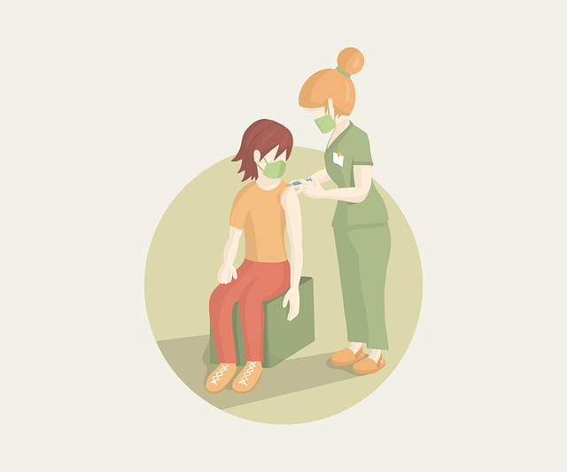
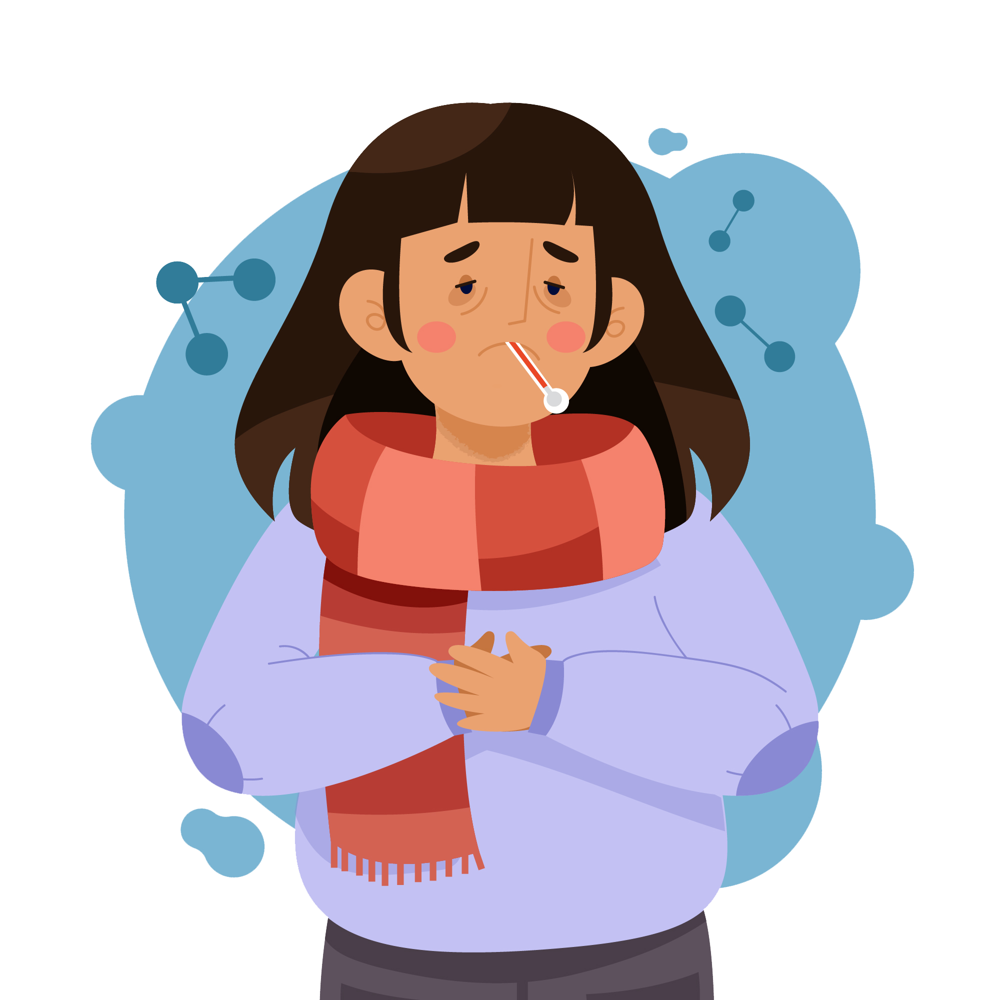
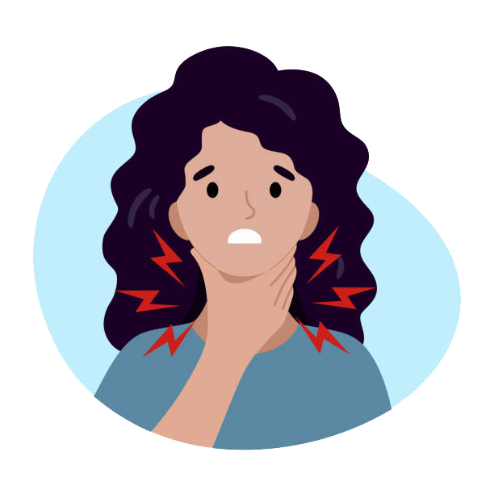
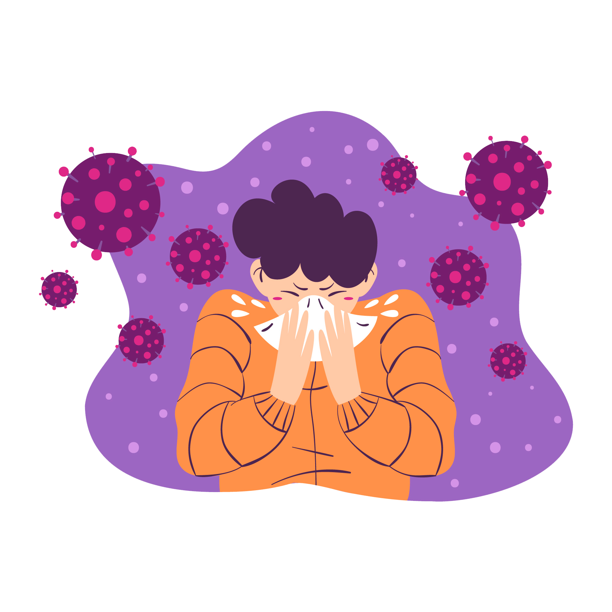
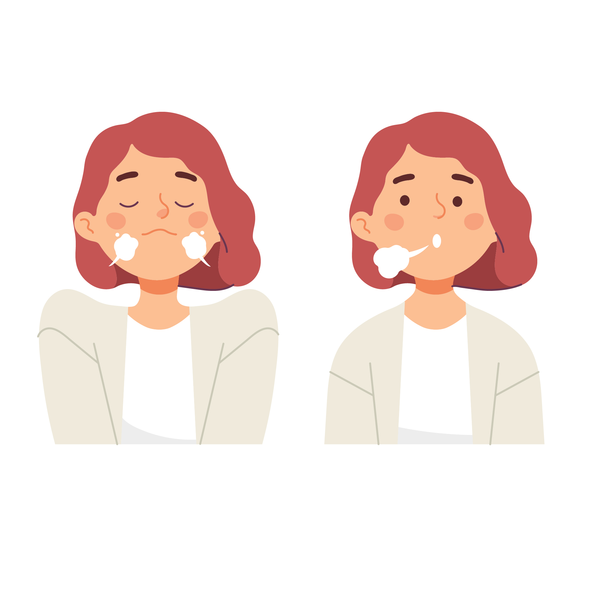
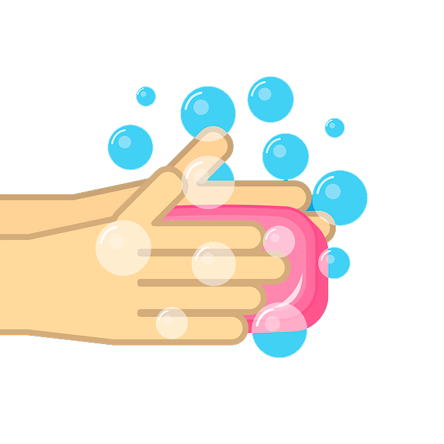
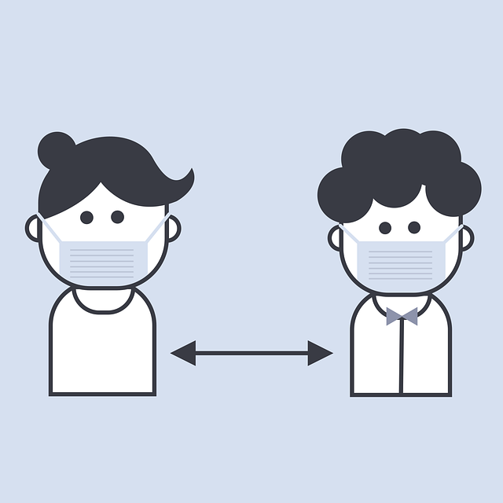

<!DOCTYPE html>
<html lang="en">

<head>

    
    <meta charset="utf-8">
    <meta http-equiv="x-ua-compatible" content="ie=edge">
    <meta name="description" content="">
    <meta name="viewport" content="width=device-width, initial-scale=1, shrink-to-fit=no">

    <title>VacunaT</title>
    <link rel="shortcut icon" href="assets/images/Vacuna Logo/Vacuna Logo.png" type="image/png">

    <link rel="stylesheet" href="assets/css/bootstrap.min.css">
    <link rel="stylesheet" href="assets/css/font-awesome.min.css">
    <link rel="stylesheet" href="assets/css/LineIcons.css">
    <link rel="stylesheet" href="assets/css/animate.css">
    <link rel="stylesheet" href="assets/css/aos.css">
    <link rel="stylesheet" href="assets/css/slick.css">
    <link rel="stylesheet" href="assets/css/default.css">
    <link rel="stylesheet" href="assets/css/style.css">

</head>

<body>
    

        

            

                

                    

                        

                            

                        

                        

                            

                        

                    

                

            

        

    

    <header id="home" class="header-area pt-100">

        

            
        

        

            
        
 
        

            
        
 
        

            
        
 

        

            

                

                    

                        <nav class="navbar navbar-expand-lg">
                            
                            <button class="navbar-toggler" type="button" data-toggle="collapse" data-target="#navbarSupportedContent" aria-controls="navbarSupportedContent" aria-expanded="false" aria-label="Toggle navigation">
                                
                                
                                
                            </button>

                            

                                <ul id="nav" class="navbar-nav ml-auto">
                                    <li class="nav-item active">
                                        <a class="page-scroll" href="#home">Inicio</a>
                                    </li>
                                    <li class="nav-item">
                                        <a class="page-scroll" href="#about">Acerca de</a>
                                    </li>
                                    <li class="nav-item">
                                        <a class="page-scroll" href="#service">Sintomas</a>
                                    </li>
                                    <li class="nav-item">
                                        <a class="page-scroll" href="#team">Medidas</a>
                                    </li>
                                    <li class="nav-item">
                                        <a class="page-scroll" href="#contact">Contacto</a>
                                    </li>
                                </ul> 
                            

                            

                                <a class="main-btn" href="#"><i class="lni-phone"></i> 01800-22-55-78-95</a>
                            

                        </nav> 
                    

                
 
            
 
        
 

        <!-- Inicio -->
        

            

                

                    

                        

                            <h4 class="sub-title wow fadeInUp" data-wow-duration="1.5s" data-wow-delay="1s">Es tu momento</h4>
                            <h1 class="banner-title mt-10 wow fadeInUp" data-wow-duration="1.5s" data-wow-delay="2s">Vacunate y vacuna a los tuyos</h1>
                            <a class="banner-contact mt-25 wow fadeInUp" data-wow-duration="1.5s" data-wow-delay="2.3s" href="#contact">Vacunas gratis = Gente FELIZ</a>
                        
 
                    

                

            
 
            

        
 

    </header>

   

   <!-- Acerca de  -->

    <section id="about" class="about-area pt-80 pb-130">
        

            

                

                    

                        

                            
                        
 
                        

                            <a class="main-btn" href="#">2 Años de Pandemia </a>
                        

                        

                            
                        
 
                    
 
                

                

                    

                        <h4 class="about-welcome">Acerca de</h4>
                        <h3 class="about-title mt-10">SARS COV 2 (COVID-19)</h3>
                        <h5 class="about-welcome"> ¿Qué es?</h5>
                        
El coronavirus SARS-Cov-2 es un virus que apareció en China. Después se extendió a todos los continentes del mundo provocando una pandemia. Actualmente Europa y América son los más afectados.
                              Este nuevo virus, provoca la enfermedad conocida con el nombre de COVID-19.
                              Todos podemos hacer algo para ayudar y contener la expansión de las enfermedades. 
                            Lo primero siempre es entender qué son, cómo se transmiten y cómo afectan.
                        

                        <a class="main-btn mt-25" href="https://coronavirus.gob.mx/todos-juntos/">Conocer más</a>
                    
 
                

            
 
        
 
    </section>

  

    <!--Sintomas-->

    <section id="service" class="services-area pt-125 pb-130 gray-bg">
        

            

                

                    

                        
                        <h2 class="title">Sintomas</h2>
                    
 
                

            

            

                

                    

                        

                            
                        

                        

                            <h4 class="services-title">Fiebre</h4>
                        

                    
 
                

                

                    

                        

                            
                        

                        

                            <h4 class="services-title">Dolor de Garganta</h4>
                        

                    
 
                

                

                    

                        

                            
                        

                        

                            <h4 class="services-title">Dolor de Cabeza</h4>
                        

                    
 
                

                

                    

                        

                            

                        

                        

                            <h4 class="services-title">Tos</h4>
                        

                    
 
                

                

                    

                        

                            
                        

                        

                            <h4 class="services-title">Escurrimiento Nasal</h4>
                        

                    
 
                

                

                    

                        

                            
                        

                        

                            <h4 class="services-title">Perdida de olfato/gusto</h4>
                        

                    
 
                

            
 
        
 
    </section>

    <!--MEDIDAS-->
    <section id="team" class="team-area pt-125 pb-130 gray-bg">
        

            

                

                    

                        <h2 class="title">Medidas de Prevención</h2>
                    
 
                

            
 
            

                

                    

                        

                            
                        

                        

                            <h4 class="team-name"><a href="#">Uso correcto de cubrebocas</a></h4>
                        

                    
 
                

                

                    

                        

                            
                        

                        

                            <h4 class="team-name"><a href="#">Lavarse las manos constantemente</a></h4>
                        

                    
 
                

                

                    

                        

                            
                        

                        

                            <h4 class="team-name"><a href="#">Uso de Gel/Spray Antibacteria</a></h4>
                        

                    
 
                

                

                    

                        

                            
                        

                        

                            <h4 class="team-name"><a href="#">Guardar distancia de 1.5 m.</a></h4>
                        

                    
 
                

            
 
        
 
    </section>

    <!--Contacto-->

    <section id="contact" class="contact-area pt-125 pb-130 gray-bg">
        

            

                

                    

                        <h5 class="sub-title mb-15">Si tienes alguna duda</h5>
                        <h2 class="title">Contactanos</h2>
                    

                

            
 
            

                

                    

                        <form id="contact-form" action="assets/contact.php" method="post" data-toggle="validator">
                            

                                

                                    

                                        <input type="text" name="name" placeholder="Nombre" data-error="Nombre es requerido." required="required">
                                        

                                    
 
                                

                                

                                    

                                        <input type="email" name="email" placeholder="Email" data-error="Email es requerido." required="required">
                                        

                                    
 
                                

                                

                                    

                                        <input type="text" name="phone" placeholder="Telefono" data-error="Telefono es requerido." required="required">
                                        

                                    
 
                                

                                

                                    

                                        <textarea placeholder="Ingresa tu duda" name="message" data-error="Campo duda es requerido" required="required"></textarea>
                                        

                                    
 
                                

                                

                                

                                    

                                        <button type="submit" class="main-btn">Enviar</button>
                                    
 
                                

                            
 
                        </form>
                    
 
                

            
 
        
 
    </section>

    
    <footer id="footer" class="footer-area">
        

            

                

                    

                        

                            
                            <ul class="footer-info">
                                <li>
                                    

                                        

                                            <i class="lni-phone-handset"></i>
                                        

                                        

                                            
+1880 123 456 789

                                        

                                    
 
                                </li>
                                <li>
                                    

                                        

                                            <i class="lni-envelope"></i>
                                        

                                        

                                            
vacunaTinfo@gmail.com

                                        

                                    
 
                                </li>
                                <li>
                                    

                                        

                                            <i class="lni-map"></i>
                                        

                                        

                                            
1234 Mexico, Mex

                                        

                                    
 
                                </li>
                            </ul>
                            <ul class="footer-social mt-20">
                                <li><a href="#"><i class="lni-facebook-filled"></i></a></li>
                                <li><a href="#"><i class="lni-twitter-original"></i></a></li>
                                <li><a href="#"><i class="lni-google"></i></a></li>
                                <li><a href="#"><i class="lni-instagram"></i></a></li>
                            </ul>
                        
 
                    

                    

                        

                            

                                <h4 class="title">Menú</h4>
                            

                            <ul class="mt-15">
                                <li><a href="#home">Inicio</a></li>
                                <li><a href="#about">Acerca de</a></li>
                                <li><a href="#service">Sintomas</a></li>
                                <li><a href="#project">Medidas</a></li>
                                <li><a href="#contact">Contacto</a></li>
                            </ul>
                        

                    

                    

                        

                            

                                <h4 class="title">Servicios</h4>
                            

                            <ul class="mt-15">
                                <li><a href="#">Información acerca de COVID-19</a></li>
                                <li><a href="#">Sedes de Vacunación</a></li>
                                <li><a href="#">Consulta de Certificados</a></li>
                            </ul>
                        

                    

                    

                        

                            

                                <h4 class="title">Registrate para más info.</h4>
                            

                            
Registrate a nuestras noticias.

                            <form action="#">
                                

                                    <input type="email" placeholder="info@contact.com">
                                    <button><i class="lni-angle-double-right"></i></button>
                                

                            </form>
                        

                    

                
 
            
 
        
 
        

            

                

                    

                        

                            
Derechos Reservados  <a href="https://vacunaT.com" rel="nofollow">VacunaT</a>

                        
 <!-- copyright -->
                    

                
 
            
 
        
 
    </footer>

   

    
    
    
    
    
    
    
    
    

</body>

</html>
